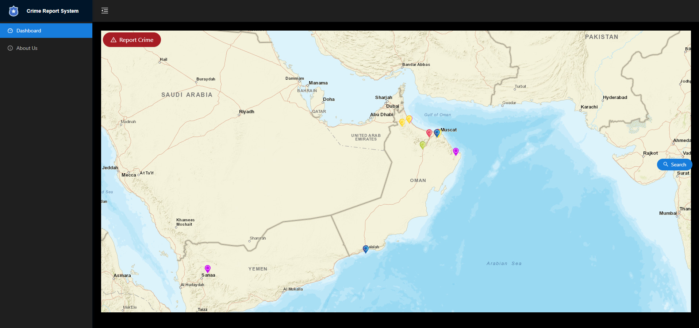
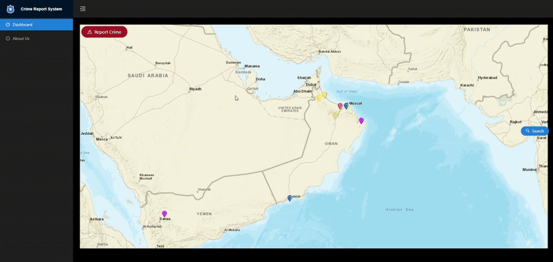
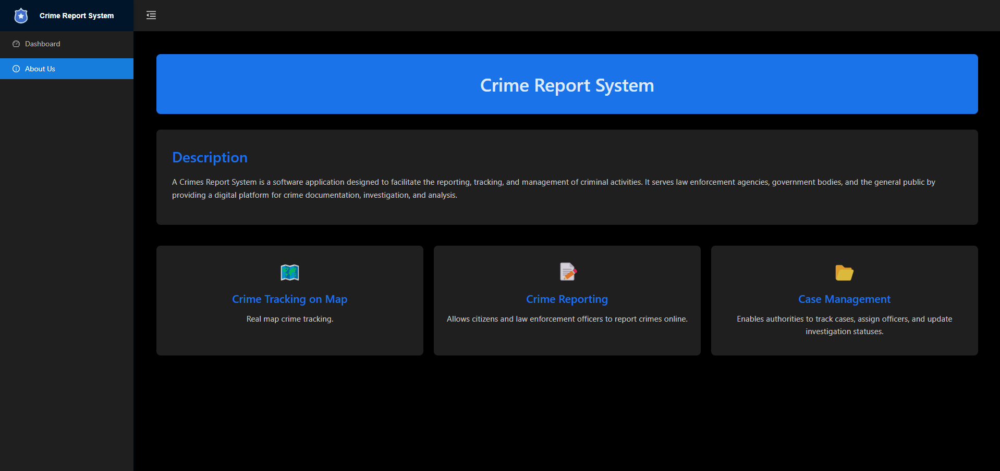

# 📌 Crimes Report System

A **Crimes Report System** is a software application designed to facilitate the reporting, tracking, and management of criminal activities. It serves law enforcement agencies, government bodies, and the general public by providing a digital platform for crime documentation, investigation, and analysis.

## 🚀 Features

- **🗺️ Crime Tracking on Map** – Real map crime tracking.
- **📝 Crime Reporting** – Allows citizens and law enforcement officers to report crimes online.
- **📂 Case Management** – Enables authorities to track cases, assign officers, and update investigation statuses.

## 🛠 Development Tools

- **Framework:** [Angular](https://angular.io/)
- **Development Server:** [json-server](https://github.com/typicode/json-server)
- **Component Library:** [ng-zorro-antd](https://ng.ant.design/)
- **Mapping Library:** [ol (OpenLayers)](https://openlayers.org/)

## 📜 Installation

### Run using Docker

1. Clone the repository:
   ```sh
   git clone https://github.com/nawaf91maqbali/rihal-codestacker-fe.git
   ```
2. Navigate to the Docker setup directory:
   ```sh
   cd rihal-codestacker-fe/docker-example
   ```
3. Run the application using Docker Compose:
   ```sh
   docker-compose up -d
   ```

   > ⚠️ **Warning:** If you changed the `crs_api` service port, you must update the `ApiUrl` port in the `environment.ts` file in the project before running the `docker-compose up -d` command.
   
   > ⚠️ **Warning:** Do not change the location of the `docker-compose.yml` file, otherwise running `docker-compose up -d` will not work.
   
   > ℹ️ **Info:** After running `docker-compose up -d`, if you want to check the API, visit: `http://localhost:crs_api_port` (e.g., in my case, `http://localhost:3333`).
   
### Run Manually

1. Clone the repository:
   ```sh
   git clone https://github.com/nawaf91maqbali/rihal-codestacker-fe.git
   ```
2. Navigate to the project directory:
   ```sh
   cd rihal-codestacker-fe
   ```
3. Install dependencies:
   ```sh
   npm install  # Install frontend dependencies
   npm install -g json-server  # Install JSON Server globally
   ```
4. Configure environment variables and database settings.
5. Start the application:
   ```sh
   json-server --watch src/data/db.json  # Start JSON Server for development
   ng serve  # Start Angular frontend
   ```

## 📝 Note

> 🚩 **Note:** The `db.json` you provided is missing one property (`national_id`), which is required when creating a new report.

   ## 🎥 Demo

You can check out a demo of the Crimes Report System below:

### Dashbard Page


### Filter Crimes


### Dashbard Page


### Filter Crimes

